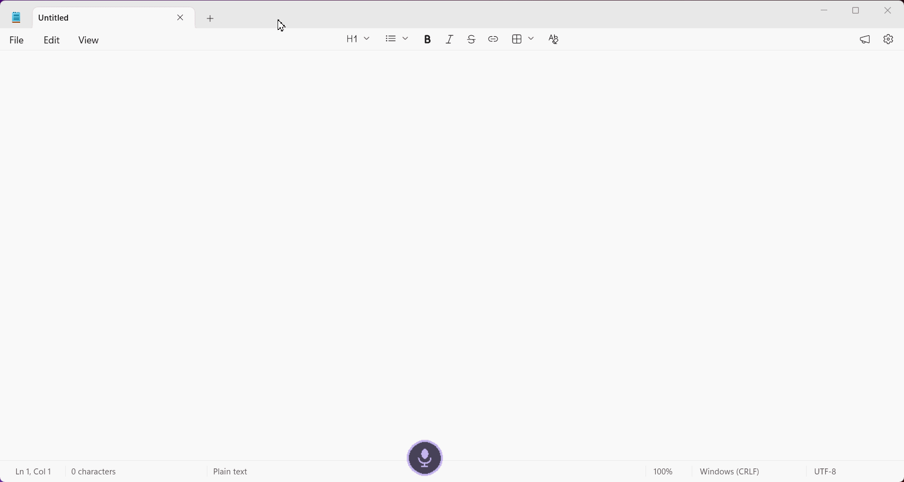
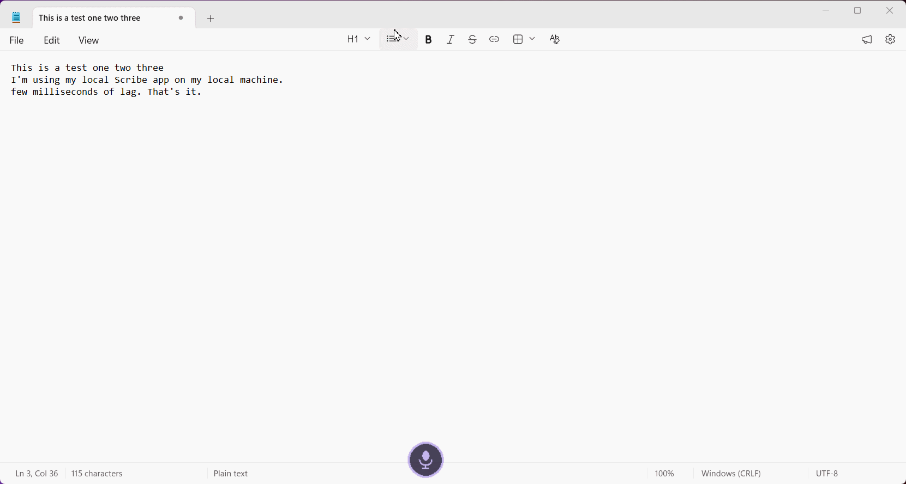
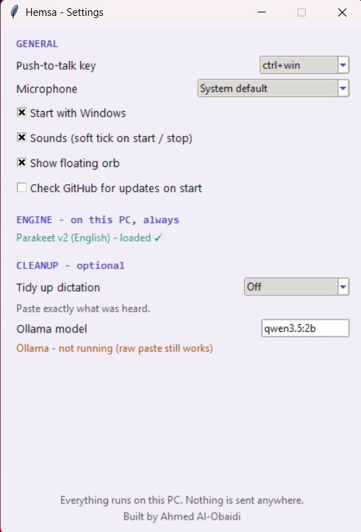
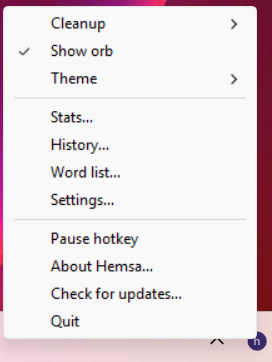
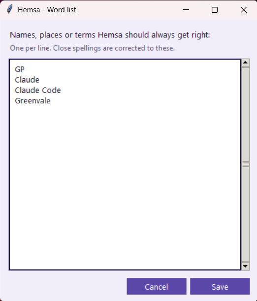

# Hemsa

*(hemsa = "whisper" in Arabic)*

Push-to-talk dictation for Windows. Hold a key (or click the floating orb), talk,
release, and clean text is typed at your cursor in whatever app you are in.

Similar to WisprFlow - but free & local (does not send your voice outside your machine).
Similar to local STT agents (like SuperWhisper or OpenWisper), but better (more minimalistic, faster)

**Everything runs on your PC.** Your voice is never uploaded, there is no account,
no API key and no subscription. After the one-time model download, Hemsa works with
the internet switched off.

Free and open source (MIT). Built by Ahmed Al-Obaidi.



## Install

1. Download `HemsaSetup-x.y.z.exe` from the [latest release](https://github.com/ahmedco88/hemsa-STT/releases).
2. Run it. **Windows will warn you** - see [below](#windows-warnings).
3. On first launch Hemsa downloads the speech model (about 660 MB, once) and asks
   you to pick a microphone and a push-to-talk key. That is the whole setup.

Then: hold **Ctrl+Win**, speak, let go. Right-click the tray icon for Stats,
History, Dictionary, Settings and the theme picker.

### Windows warnings

Hemsa is not code-signed, because a certificate that satisfies SmartScreen costs
several hundred dollars a year and this is a free app. Windows therefore shows two
warnings, and you should know what they look like before you meet them:

- **In your browser:** "HemsaSetup.exe isn't commonly downloaded." Choose Keep.
- **On launch:** a blue "Windows protected your PC" screen. Click **More info**,
  then **Run anyway**.

Both appear for any unsigned app regardless of what it does. If you would rather
not trust a binary from a stranger on the internet, that is the correct instinct:
run it from source instead (below) - it is the same code.

## What it looks like

The floating orb sits above whatever you are working in and never takes your text
cursor. Click it to dictate, right-click it for the last transcript and the rest.



Settings, and the tray menu. The engine line tells you the model is loaded and
running locally, and cleanup is off unless you turn it on.

<p>
  
  
</p>

The word list is the one thing worth setting up. Type a name, place or term the way
it should be typed, one per line, and close spellings get corrected to it. You never
have to record what the model got wrong.



## How it works

- **Speech-to-text:** [Parakeet TDT 0.6B v2](https://huggingface.co/csukuangfj/sherpa-onnx-nemo-parakeet-tdt-0.6b-v2-int8)
  (int8, English) via [sherpa-onnx](https://github.com/k2-fsa/sherpa-onnx), CPU only,
  around 40x real time. Model licence: CC-BY-4.0.
- **Optional cleanup:** a small local model (`qwen3.5:2b`) via [Ollama](https://ollama.com),
  **off by default**. Tidies punctuation and filler words, still entirely on-device.
- **Word list:** one column of names and jargon the model keeps getting wrong. An
  exact pass fixes spelling and case, then a local fuzzy pass (difflib, about 0.3 ms,
  no AI) catches the near-misses. It is built to refuse: an entry for "Claude" will
  not touch the ordinary word "cloud".
- Python 3.12, tkinter, pystray, packaged with PyInstaller.

### What touches the network

Two things, both optional and both visible:

| When | What | Sends |
|---|---|---|
| First run | Downloads the speech model from Hugging Face | nothing about you |
| If you tick "check for updates" | Asks GitHub for the latest version number | nothing about you |

The update check is **off by default**. There is no telemetry, no analytics and no
crash reporting. Your dictations, history and settings stay in
`%LOCALAPPDATA%\Hemsa\` and are never transmitted.

## Run from source

```
git clone https://github.com/ahmedco88/hemsa-STT
cd hemsa-STT
py -3.12 -m venv .venv
.venv\Scripts\python.exe -m pip install -r requirements.txt
.venv\Scripts\python.exe -m hemsa
```

First launch runs the same setup and downloads the model to
`%LOCALAPPDATA%\Hemsa\models\parakeet-v2`. Already have the files? Point
`HEMSA_MODELS_DIR` at the folder and Hemsa will use them instead of downloading.

Other commands:

```
.venv\Scripts\python.exe -m hemsa --selftest
.venv\Scripts\python.exe -m pytest tests -q
```

## Build the installer

```
.venv\Scripts\pyinstaller.exe hemsa.spec --noconfirm
"C:\Program Files (x86)\Inno Setup 6\ISCC.exe" installer\hemsa.iss
```

`dist\Hemsa\Hemsa.exe` is the packaged app; the installer lands in `installer\out\`.
The speech model is deliberately **not** bundled, which keeps the installer small
and lets the model live outside Program Files.

## Notes

- Windows shows the microphone-in-use indicator the whole time Hemsa runs. The mic
  stream is opened once and gated, because opening a device per keypress cost
  150-250 ms of lag on every single press.
- Uninstalling leaves your settings and the downloaded model in place unless you
  say otherwise, so reinstalling does not mean downloading 660 MB again.

## Licence

MIT - see [LICENSE](LICENSE). The speech model is licensed separately (CC-BY-4.0).
