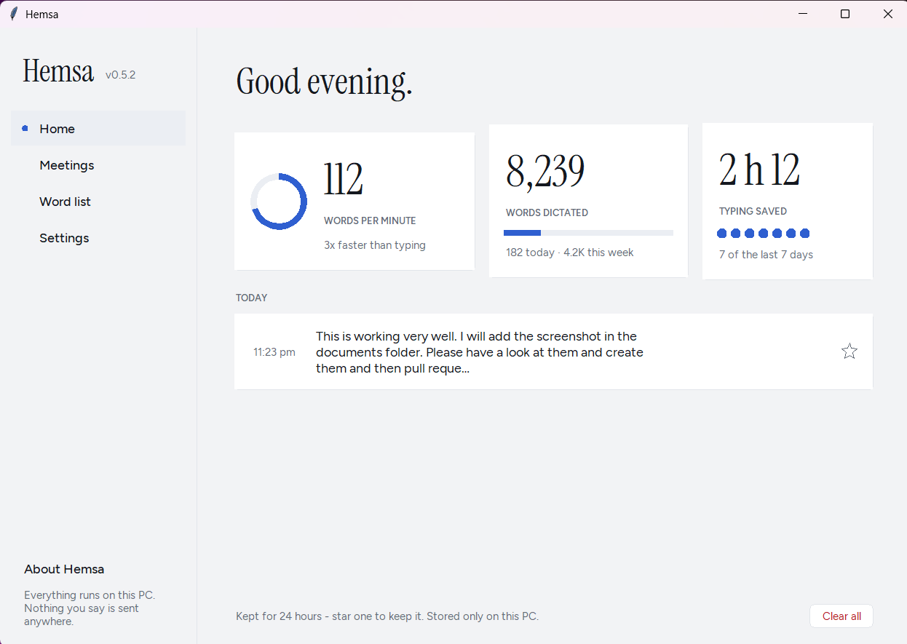
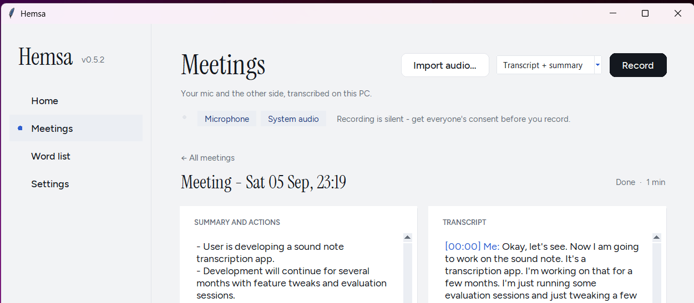

# Hemsa

*(hemsa = "whisper" in Arabic)*

Push-to-talk dictation for Windows. Hold a key (or click the floating orb), talk,
release, and clean text is typed at your cursor in whatever app you are in.

**Everything runs on your PC.** Your voice is never uploaded, there is no account,
no API key and no subscription. After the one-time model download, Hemsa works with
the internet switched off.

Free and open source (MIT). Built by Ahmed Al-Obaidi.


## Install

1. Download `HemsaSetup-x.y.z.exe` from the [latest release](https://github.com/ahmedco88/hemsa-STT/releases).
2. Run it. **Windows will warn you** - see [below](#windows-warnings).
3. On first launch Hemsa downloads the speech model (about 660 MB, once) and asks
   you to pick a microphone and a push-to-talk key. That is the whole setup.

Then: hold **Ctrl+Win**, speak, let go. Everything else lives in one window,
opened from the tray icon or by double-clicking the orb: Home, Meetings, Word list
and Settings down the side.

### Windows warnings

Hemsa is not code-signed, because a certificate that satisfies SmartScreen costs
several hundred dollars a year and this is a free app. Windows therefore shows two
warnings, and you should know what they look like before you meet them:

- **In your browser:** "HemsaSetup.exe isn't commonly downloaded." Choose Keep.
- **On launch:** a blue "Windows protected your PC" screen. Click **More info**,
  then **Run anyway**.

Both appear for any unsigned app regardless of what it does. If you would rather
not trust a binary from a stranger on the internet, that is the correct instinct:
run it from source instead (below) - it is the same code.

## What it looks like

Everything except the orb lives in one window. **Home** opens on your counters and
everything you have dictated recently, newest first. Hover a line to copy it back,
delete just that one, or star it to keep it past the 24 hours.



The floating orb sits above whatever you are working in and never takes your text
cursor. Click it to dictate, right-click it for the last transcript and the rest.


A finished meeting, summary and actions on the left, the labelled transcript on the
right. **Me** is your microphone and **Them** is everything else on the call.



Settings. The push-to-talk key, the microphone, four themes, and cleanup, which is
off unless you turn it on.


The **Word list** page is the one thing worth setting up. Type a name, place or term
the way it should be typed, one per line, and close spellings get corrected to it.
You never have to record what the model got wrong.

## Meetings

Hemsa can also record a meeting and write it up afterwards. It captures two
channels: your microphone, and whatever is coming out of your speakers, so both
sides of a call are transcribed and labelled.

Like dictation, all of it happens on your PC. Nothing is uploaded.

**Importing a file you already have** (`.m4a`, `.mp4`, `.mp3`) works only when you
run Hemsa from source, with `pip install av`. It is left out of the installer on
purpose: the ffmpeg build that PyAV ships includes GPL-licensed encoders, and
Hemsa is MIT. Recording, transcription and summaries need none of it. Details in
[THIRD-PARTY-NOTICES.md](THIRD-PARTY-NOTICES.md).

**Two things to be clear about before you use it.**

- **Consent is your responsibility.** Hemsa records the other party silently, and
  they have no way of knowing. In several Australian states, and in many other
  places, recording a private conversation without every party's consent is an
  offence, whether or not you are part of that conversation. Get consent first.
- **The summary is machine-generated and unverified.** The transcript comes from a
  speech model and the summary and action list come from a small local language
  model. Both make mistakes: mishearings, missed points, and statements that are
  subtly wrong about who said what or what was decided. Action items carry no owner
  on purpose, because the model cannot reliably work out whose job something is.
  **Read the transcript before you rely on any of it.** It is a draft to check,
  never a record, and it is not suitable as a clinical or legal document.

## Ollama (optional, for cleanup and summaries)

Two features call a small language model on your PC through
[Ollama](https://ollama.com): the **AI cleanup** mode for dictation, and the
**summary and action list** for meetings. Everything else works without it.
Dictation, the word list and meeting *transcripts* never touch Ollama.

If Hemsa says *"Ollama is not running"*, nothing is broken and nothing is lost.
A meeting still records and still transcribes. Only the summary is skipped.

**Set it up once**

1. Install Ollama from [ollama.com/download](https://ollama.com/download).
2. Pull the model Hemsa uses:

   ```
   ollama pull qwen3.5:2b
   ```

**Start it**

Easiest: open **Meetings** in Hemsa. If Ollama is down it says so, and gives you a
**Start Ollama** button and a **Check again** button right under the warning. That
is the whole job, and you do not need the rest of this section.

Otherwise, Ollama has to be *running* before Hemsa can reach it. Either:

- Open the **Ollama** app from the Start menu. It sits in the system tray and
  starts itself with Windows from then on. This is the one to use if you want to
  stop thinking about it.
- Or run this in a terminal and leave the window open:

  ```
  ollama serve
  ```

**Check it is up**

Open <http://localhost:11434> in a browser. "Ollama is running" means you are
set. In Hemsa, the Settings page shows the same thing, and the Meetings page
warns you *before* you record rather than after.

Started it outside Hemsa while the warning was up? Press **Check again**. Hemsa
only re-checks at the moments that matter, so it will not notice on its own.

**Using a different model or machine**

`cleanup_model` and `ollama_url` in `%LOCALAPPDATA%\Hemsa\config.json` are both
editable, so you can point Hemsa at another model or at an Ollama on your
network. Be careful swapping in something smaller than `qwen3.5:2b`: every 1B
model tested answered a dictated *question* instead of transcribing it, which for
a medical question means inventing a dose.


## How it works

- **Speech-to-text:** [Parakeet TDT 0.6B v2](https://huggingface.co/csukuangfj/sherpa-onnx-nemo-parakeet-tdt-0.6b-v2-int8)
  (int8, English) via [sherpa-onnx](https://github.com/k2-fsa/sherpa-onnx), CPU only,
  around 40x real time. Model licence: CC-BY-4.0.
- **Optional cleanup:** a small local model (`qwen3.5:2b`) via [Ollama](https://ollama.com),
  **off by default**. Tidies punctuation and filler words, still entirely on-device.
- **Word list:** one column of names and jargon the model keeps getting wrong. An
  exact pass fixes spelling and case, then a local fuzzy pass (difflib, about 0.3 ms,
  no AI) catches the near-misses. It is built to refuse: an entry for "Claude" will
  not touch the ordinary word "cloud".
- **Meetings:** system audio is captured with WASAPI loopback (PyAudioWPatch),
  long recordings are cut on silence into chunks before transcription, and the
  summary uses the same local `qwen3.5:2b` as cleanup. Imported files are decoded
  with PyAV. Meetings are stored in `%LOCALAPPDATA%\Hemsa\`, like everything else.
- Python 3.12, tkinter, pystray, packaged with PyInstaller.

### What touches the network

Three things, all optional and all visible:

| When | What | Goes where |
|---|---|---|
| First run | Downloads the speech model from Hugging Face | out to the internet, sends nothing about you |
| If you tick "check for updates" | Asks GitHub for the latest version number | out to the internet, sends nothing about you |
| AI cleanup, or a meeting summary | Sends the text to Ollama | `localhost` only, unless you repoint `ollama_url` yourself |

The update check is **off by default**, and so is AI cleanup. There is no
telemetry, no analytics and no crash reporting.

To be exact about the third row, because it is the one that carries your words:
cleanup and summaries POST your dictated text or your meeting transcript to
whatever `ollama_url` in your config points at. **Out of the box that is
`http://localhost:11434`, a server on your own PC**, which is why Hemsa still
works with the internet switched off. If you edit `ollama_url` to reach an Ollama
on another machine, your text goes to that machine. Nothing else Hemsa does
transmits anything: your dictations, history, meetings, word list and settings
sit in `%LOCALAPPDATA%\Hemsa\` and are never sent anywhere.

## Run from source

```
git clone https://github.com/ahmedco88/hemsa-STT
cd hemsa-STT
py -3.12 -m venv .venv
.venv\Scripts\python.exe -m pip install -r requirements.txt
.venv\Scripts\python.exe -m hemsa
```

First launch runs the same setup and downloads the model to
`%LOCALAPPDATA%\Hemsa\models\parakeet-v2`. Already have the files? Point
`HEMSA_MODELS_DIR` at the folder and Hemsa will use them instead of downloading.

Other commands:

```
.venv\Scripts\python.exe -m hemsa --selftest
.venv\Scripts\python.exe -m pytest tests -q
```

## Build the installer

```
.venv\Scripts\pyinstaller.exe hemsa.spec --noconfirm
"%LOCALAPPDATA%\Programs\Inno Setup 6\ISCC.exe" installer\hemsa.iss
```

`dist\Hemsa\Hemsa.exe` is the packaged app; the installer lands in `installer\out\`.
The speech model is deliberately **not** bundled, which keeps the installer small
and lets the model live outside Program Files.

## Notes

- Windows shows the microphone-in-use indicator the whole time Hemsa runs. The mic
  stream is opened once and gated, because opening a device per keypress cost
  150-250 ms of lag on every single press.
- Uninstalling leaves your settings and the downloaded model in place unless you
  say otherwise, so reinstalling does not mean downloading 660 MB again.

## Licence

MIT - see [LICENSE](LICENSE). The speech model is licensed separately (CC-BY-4.0),
and the installed app bundles other people's libraries under their own licences:
see [THIRD-PARTY-NOTICES.md](THIRD-PARTY-NOTICES.md), which also explains why
the installer ships no ffmpeg at all, and so no file import.
